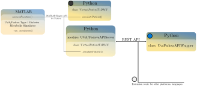

# An application programming interface for the widely used academic version of the UVA/Padova Type 1 Diabetes Metabolic simulator

The UVA/Padova Type 1 Diabetes Simulator is a widely applied tool to test control algorithms among diabetes researchers. The academic version is implemented in Matlab, while Matlab is very popular in the academic field, Python is the most popular programming language. We developed an application programming interface (API) for the simulator in Python, and an additional Python wrapper for easier usage. The interface is designed with the specific purpose of testing control algorithms, thus it doesn't provide the full functionality of the Matlab simulator. The developed API is tested for different simulation scenarios, showcasing identical results between the API and the original simulator.

## What can I do with the API?

* Simulate virtual patients from native Python. ⚫
* Simulate virtual patients through REST API using a Python reference wrapper. 🔵
* Simulate virtual patients through REST API. ⚪

## How to get the API up and running?

### Requirements:
 * Working Matlab version:
   * Academic version of the <a href="https://tegvirginia.com/" target="_blank">UVA/Padova Type 1 Diabetes Metabolic Simulator</a>.
   * Installed <a href="https://www.mathworks.com/help/matlab/matlab_external/get-started-with-matlab-engine-for-python.html" target="_blank">Matlab Engine</a>.
 * Installed Python.
### Setup:
 * Clone the repository.
 * Install requirements.txt.
 * Copy src\UVAPadova\connect_function.m to your UVA/Padova Simulator installation folder.
 * Run uva_padova_API.py
 * Run one of the examples.

### Notes:
  * If the UVA/Padova Simulator is not installed in the default path, src\UVAPadova\LicenseManagerAPI.bat and src\UVAPadova\VirtualPatientT1DMS.py has to be modified.

## Documentation

## Cite
